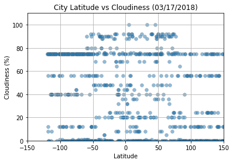

## WeatherPy

Here, we are given the task to data-mine, prepare and analyze and at the same time create visualization using matplotlib library. The data that we need extracting through an API are weather data of more than 500 cities across the globe of varying distance from the equator. 

 To accomplish this, we need:
 1. [Simple Python library](https://pypi.python.org/pypi/citipy)
 2. [OpenWeatherMap API](https://openweathermap.org/api)
 3. Use the Matplotlib and Seaborn libraries
 
Our objective is to build a series of scatter plots to showcase the following relationships:

* Temperature (F) vs. Latitude
* Humidity (%) vs. Latitude
* Cloudiness (%) vs. Latitude
* Wind Speed (mph) vs. Latitude

Our final notebook must:

* Must have selected **at least** 500 randomly unique (non-repeat) cities based on latitude and longitude.
* Perform a weather check on each of the cities using a series of successive API calls. 
* Include a print log of each city as it's being processed with the city number, city name, and requested URL.
* Save both a CSV of all data retrieved and png images for each scatter plot.
